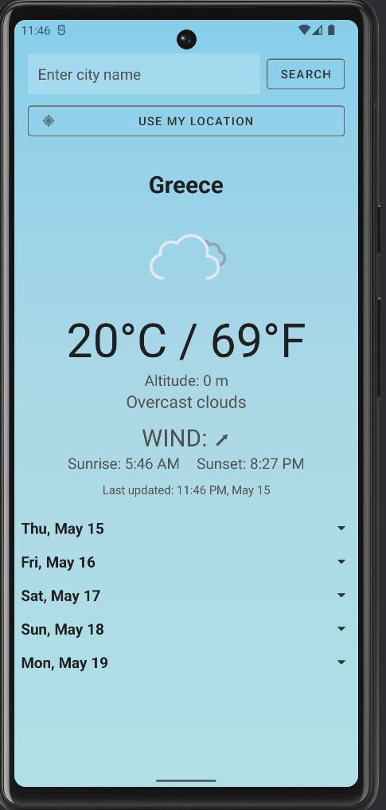
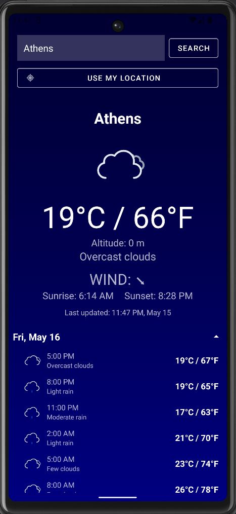
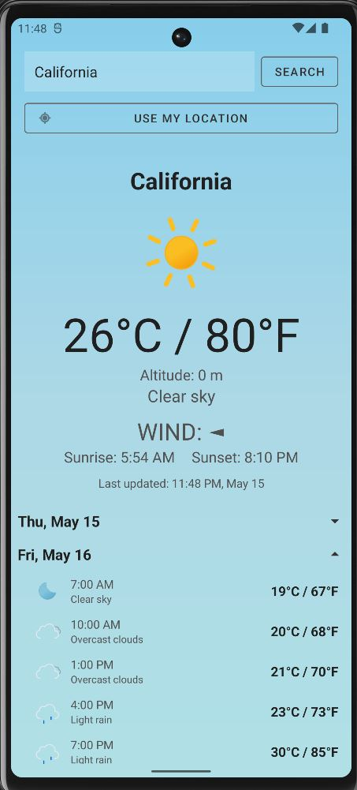

# MyWeatherApp

## Overview

**MyWeatherApp** is a feature-rich Android weather application built with Kotlin. It provides accurate current weather and a 5-day forecast for any city you search or your current GPS location. It also shows altitude based on the device’s barometric sensor and uses engaging Lottie animations for weather conditions.

---

## Features

- Current weather: city name, temperature (°C/°F), weather description, wind speed with directional arrow, sunrise & sunset, and last updated time.
- Expandable 5-day forecast with hourly details.
- Dynamic UI theme that switches between day and night based on the current time.
- Location-based weather fetching using GPS.
- Altitude display from the device's pressure sensor.
- Swipe-to-refresh to update weather data.
- Robust error handling for invalid inputs, network issues, and missing API keys.
- Uses OpenWeatherMap API with Kotlin Coroutines and Ktor for networking.
- Lottie animations to visualize weather instead of static icons.

---

## 📸 Screenshots

| Main Screen | Athens | California |
|-------------|--------|------------|
|  |  |  |

---

---

## 🛠️ Technologies Used

- Kotlin
- Jetpack Compose + Material Components
- Android Architecture Components (ViewModel, LiveData)
- Ktor (Networking)
- kotlinx.serialization (JSON parsing)
- Coil 3 (Lottie animation loading)
- FusedLocationProviderClient (Location services)
- SensorManager (Pressure sensor)
- OpenWeatherMap API

---

##  Ideas

- Favorites list with saved cities  
- Dark mode toggle  
- Weather alerts (push notifications)  
- Localization support (multi-language)

---

##  APK Release

If you prefer not to build it yourself, you can download the non-licensed APK version from the [Releases](https://github.com/RaeXp917/Weather-app/releases/tag/test) section and install it directly on your Android device.

⚠️ **Disclaimer:** This APK is provided "as is" for educational and testing purposes.  
I am **not responsible** for any damage, data loss, or issues caused by using this application.  
Install and use it **at your own risk**.
